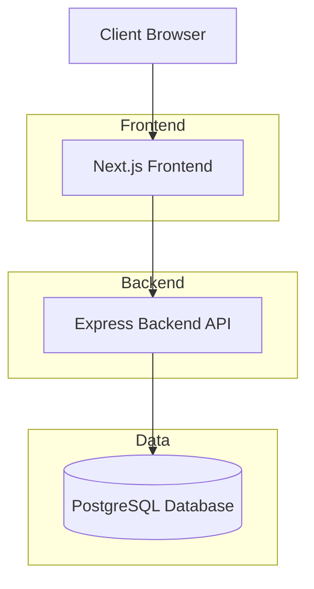
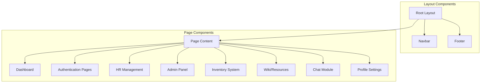
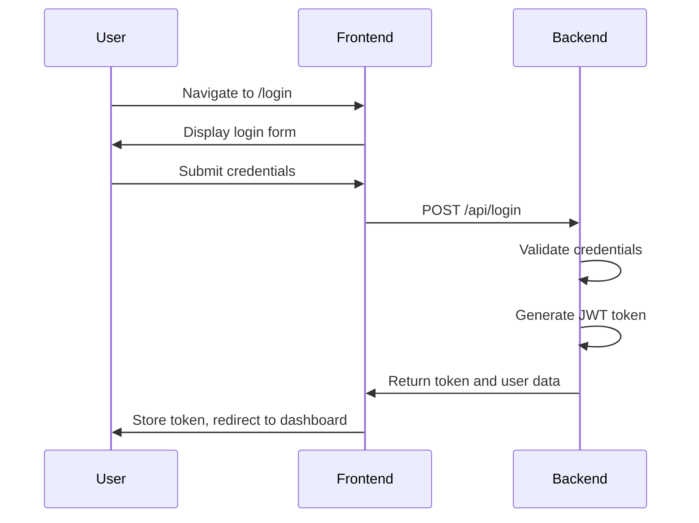
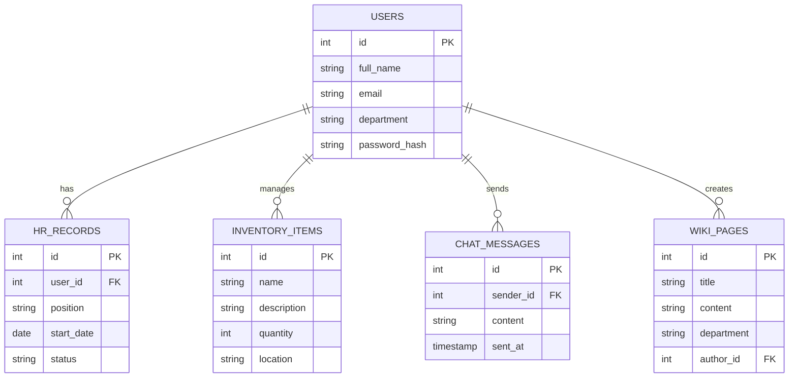
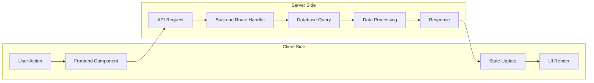

# T-Office Architecture Diagram

This document provides a comprehensive overview of the T-Office project architecture, including the directory structure, key components, and system interactions.

## Table of Contents
1. [Overview](#overview)
2. [High-Level Architecture](#high-level-architecture)
3. [Directory Structure](#directory-structure)
4. [Frontend Architecture](#frontend-architecture)
5. [Backend Architecture](#backend-architecture)
6. [Data Flow](#data-flow)
7. [Technology Stack](#technology-stack)

## Overview

T-Office is a full-stack internal office management platform designed to streamline administrative, HR, inventory, and collaboration workflows within an organization. It combines frontend interactivity with backend services to support features like user authentication, chat, dashboards, HR onboarding, and inventory tracking.

## High-Level Architecture



## Directory Structure

```
T-Office/
├── app/                     # Next.js App Router pages and layouts
│   ├── login/               # Authentication pages
│   ├── signup/
│   ├── dashboard/           # Main dashboard page
│   ├── hr/                  # HR management section
│   ├── admin/               # Admin panel
│   ├── inventory/           # Inventory management
│   ├── resources/wiki/      # Knowledge base/wiki
│   ├── chat/                # Chat module
│   ├── profile/             # User profile settings
│   ├── clock/               # Time tracking
│   ├── settings/            # Application settings
│   ├── about/               # About page
│   ├── help/                # Help documentation
│   ├── offline/             # Offline support page
│   ├── test/                # Testing pages
│   ├── layout.tsx           # Root layout component
│   └── page.tsx             # Home page
├── backend/                 # Express backend server
│   ├── routes/              # API route handlers
│   ├── utils/               # Helper functions
│   ├── index.js             # Server entry point
│   └── package.json         # Backend dependencies
├── components/              # Reusable UI components
│   ├── ui/                  # Atomic design system components
│   ├── navbar.tsx           # Navigation component
│   ├── footer.tsx           # Footer component
│   └── dashboard-layout.tsx # Dashboard layout
├── lib/                     # Shared logic and utilities
│   ├── auth-context.tsx     # Authentication context
│   └── ui-context.tsx       # UI context provider
├── public/                  # Static assets
│   ├── manifest.json        # PWA manifest
│   └── sw.js                # Service worker
├── db/                      # Database migration files
├── hooks/                   # Custom React hooks
└── package.json             # Root dependencies and scripts
```

## Frontend Architecture

The frontend is built with Next.js 13.5.1 using the App Router pattern. It follows a component-based architecture with a clear separation of concerns.

### Key Components



### Authentication Flow



## Backend Architecture

The backend is a standalone Node.js + Express server that exposes RESTful endpoints for the frontend to consume.

### API Structure

```mermaid
graph TD
    A[Express Server] --> B[Middleware]
    A --> C[Route Handlers]
    
    B --> D[CORS]
    B --> E[Body Parser]
    B --> F[Auth Middleware]
    
    C --> G[/api/auth]
    C --> H[/api/hr]
    C --> I[/api/admin]
    C --> J[/api/inventory]
    C --> K[/api/chat]
    C --> L[/api/profile]
    C --> M[/api/wiki]
    
    subgraph Middleware
        D
        E
        F
    end
    
    subgraph Routes
        G
        H
        I
        J
        K
        L
        M
    end
```

### Database Schema



## Data Flow



## Technology Stack

### Frontend
- **Framework**: Next.js 13.5.1 (App Router)
- **Language**: TypeScript
- **Styling**: Tailwind CSS 3.3.3
- **UI Components**: Radix UI primitives
- **State Management**: React Context API
- **Form Handling**: React Hook Form + Zod
- **Icons**: Lucide React
- **Notifications**: Sonner

### Backend
- **Runtime**: Node.js
- **Framework**: Express
- **Database**: PostgreSQL (pg driver)
- **Authentication**: JWT
- **Password Security**: bcrypt
- **Environment Management**: dotenv

### DevOps & Tooling
- **Build Tool**: npm scripts
- **Development Orchestration**: concurrently
- **Containerization**: Docker
- **Linting**: ESLint + TypeScript