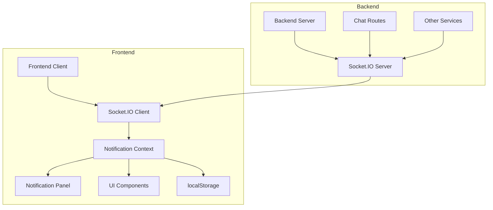
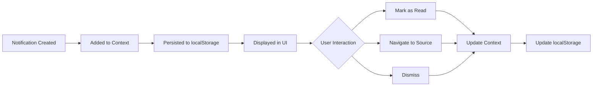

# Notification System Architecture

## Component Diagram

## Data Flow

1. **User Action**: User sends a chat message
2. **API Call**: Frontend makes POST request to chat endpoint
3. **Message Processing**: Backend saves message to database
4. **Notification Broadcasting**: Backend sends notification via Socket.IO to all other connected users
5. **Client Reception**: Frontend receives notification via WebSocket
6. **State Update**: Notification context updates with new notification
7. **UI Update**: Notification panel and header badge update
8. **Persistence**: Notification saved to localStorage

## Notification Lifecycle

